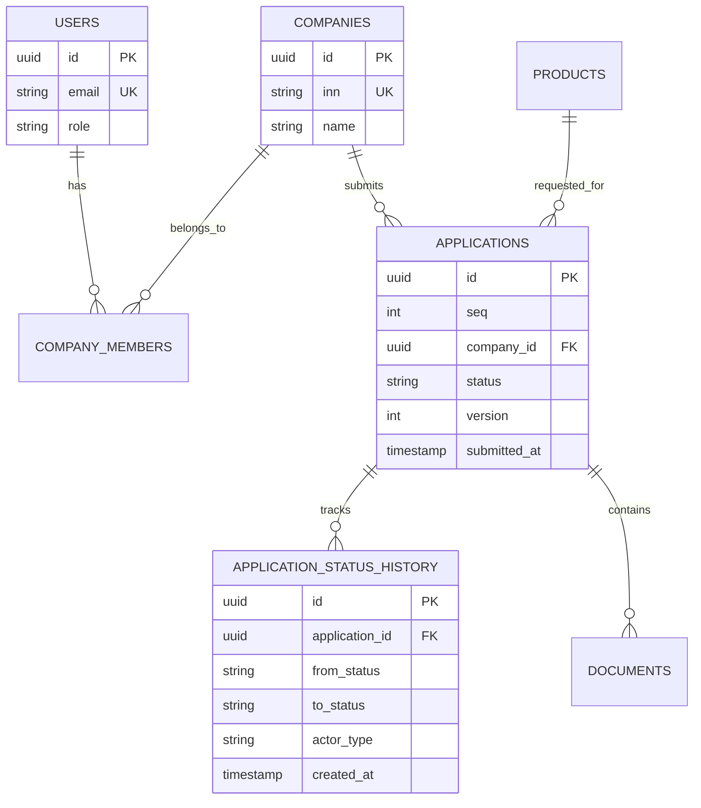

# Модель данных

```mermaid
erDiagram
    USERS ||--o{ COMPANY_MEMBERS : has
    COMPANIES ||--o{ COMPANY_MEMBERS : belongs_to
    COMPANIES ||--o{ APPLICATIONS : submits
    PRODUCTS ||--o{ APPLICATIONS : requested_for
    APPLICATIONS ||--o{ APPLICATION_STATUS_HISTORY : tracks
    APPLICATIONS ||--o{ DOCUMENTS : contains
    
    USERS {
        uuid id PK
        string email UK
        string role
    }
    
    COMPANIES {
        uuid id PK
        string inn UK
        string name
    }
    
    APPLICATIONS {
        uuid id PK
        int seq
        uuid company_id FK
        string status
        int version
        timestamp submitted_at
    }
    
    APPLICATION_STATUS_HISTORY {
        uuid id PK
        uuid application_id FK
        string from_status
        string to_status
        string actor_type
        timestamp created_at
    }
```